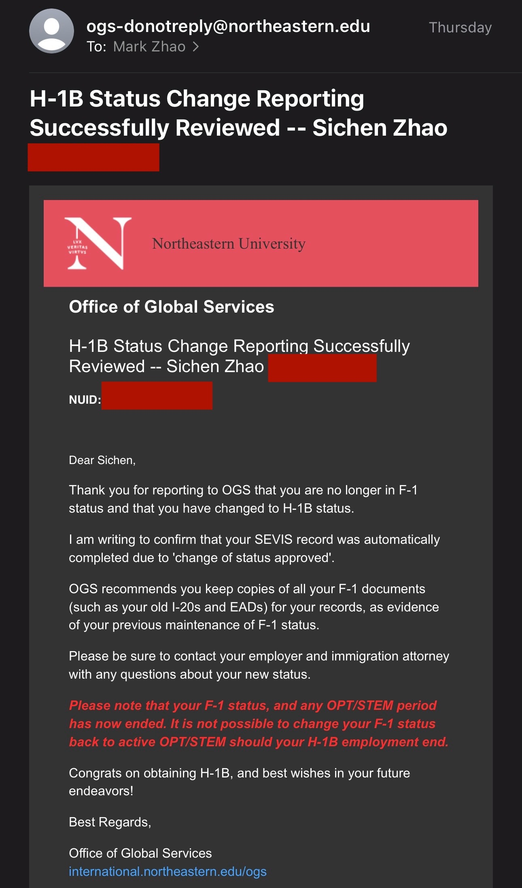

自从抽到H1B之后，一直拖着没给学校报告，在马上去加拿大面签之际，我终于给学校提交了状态变化的申请，于是收到了下面的回复：

>Congrats on obtaining H-1B, and best wishes in your future endeavors!

这一刻就意味着正式向我的学生时代告别了，从此我在美国不再受到学校的庇护，而是开始辗转流亡于各个公司内，在一个又一个的身份向上改变的进程中挣扎。

再见我的学生时代，我会永远怀念你。

