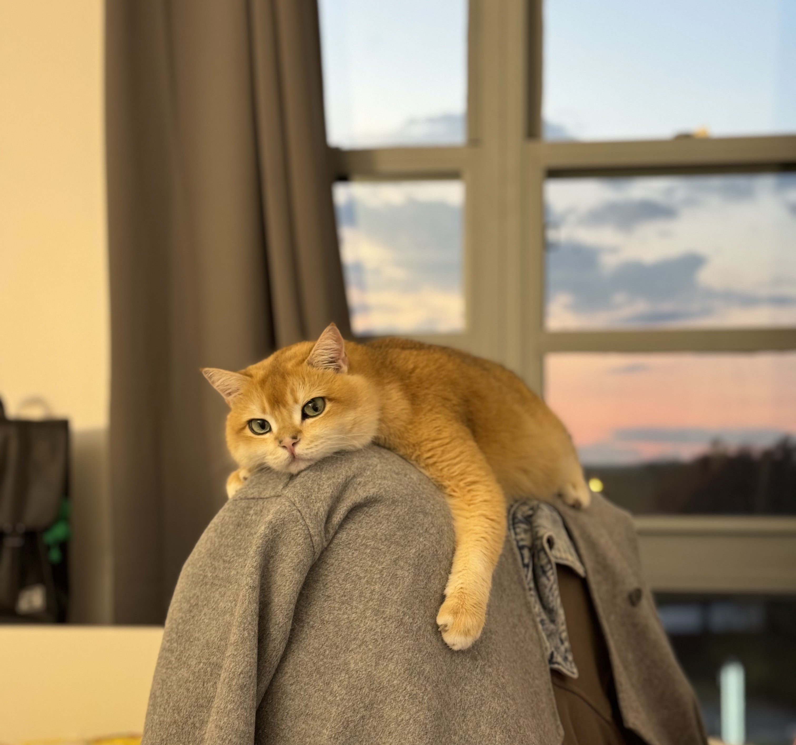

---
title: "关于小可的几个有趣的事实"
date: 2024-02-21T03:32:20Z
math: 
license: 
hidden: false
comments: true
draft: false
categories:
    - memo
--- 

关于小可的几个有趣的事实：
- 有一天，小可没有守在冰箱前面抓老鼠，后来这一天被称之为星期日
- 中文里的「臭」是基于小可的屁来定义的
- 小可曾经踢过一匹马的下巴，现在这种动物被称之为长颈鹿
- 小可曾表达老了想炒股，不玩虚拟货币只因为他父亲年轻时被Coinbase裁过员

关于小可的几个有趣的事实（二）：
- 小可一坨屎花掉了$4500
- 小可住院期间的病友是只很mean的黑猫，连医生都不喜欢他

